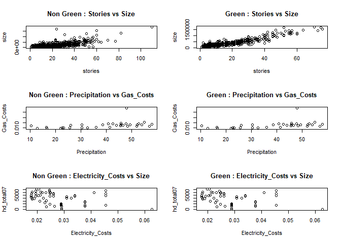
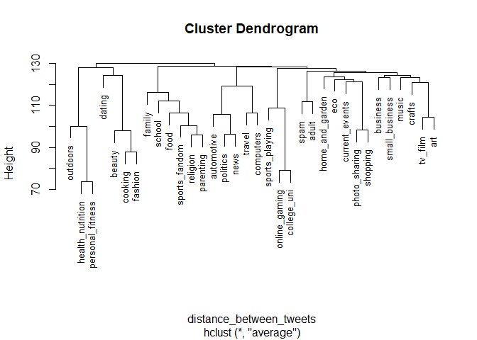
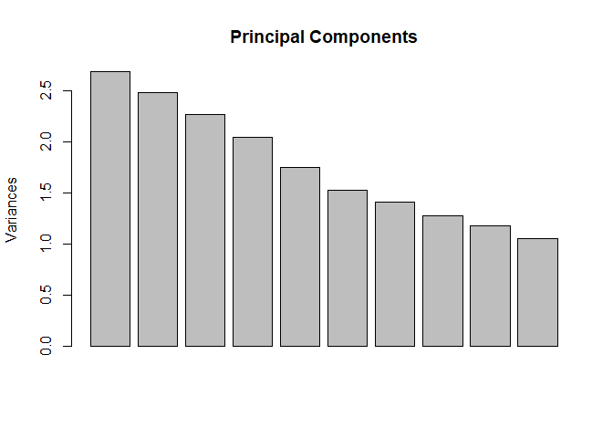

STA380 - Exercise01
================
Siddhant Shah, Sidhaarthan Velur Golpalakrishnan, Saswata Das and Anurag Agarwal
10 August 2017

### Probability Practice

##### Part A

Let X be the random variable with following space -

-   X = TC means True Clicker
-   X = RC means Random Clicker

Let Y be the random variable with following space -

-   Y = Yes means User answered Yes
-   Y = No means User answered No

From the information given, we know that

-   P(X=RC) = 0.3
-   P(Y=Yes|X=RC) = 0.5
-   P(Y=Yes) = 0.65

We need to find P(Y=Yes|X=TC)

From Total Law of Probability,

P(Y=Yes) = P(Y=Yes|X=TC)P(X=TC) + P(Y=Yes|X=RC)P(X=RC)

=&gt; 0.65 = P(Y=Yes|X=TC)\*0.7 + 0.5\*0.3

=&gt; P(Y=Yes|X=TC) = 5/7

Fraction of people who are truthful clickers and answered yes = 5/7

##### Part B.

From the information given, we know that

Sensitivity = 0.993 = P(PT/D) Specificity = 0.9999 = P(NT/D') P(D) = 0.0025% = 0.000025

where PT - Positive test NT - Negative test D - Person has the disease D' - Person does not have the disease

We need to find P(D/PT)

We know, by Bayes' theorem,

          P(D/PT) = P(D) * P(PT/D) / P(PT)
                  
                  = 0.000025*0.993 / P(PT)                              --------- (1)
                  
          
          P(PT)   = P(PT, D) + P(PT, D')
          
                  = P(PT|D)*P(D) + P(PT|D')*P(D')
                  
                  = 0.993*0.000025 + (1-0.9999)*(1-0.000025)
                  
          P(PT)   = 0.000124822                                         --------- (2)
          

Substituting (2) in (1):

          P(D/PT) = 0.000025*0.993 / 0.000124822
          
          P(D/PT) = 0.1988 (approx 20%)   

From the above result, we can conclude that the probability of a positive test result truly detecting a disease is only about 20%. Therefore, the results of this test is not a good measure of detection due to the high ***false positive*** rate.

------------------------------------------------------------------------

### Green Building

The case is to decide whether building a green building is profitable over building a non-green building. Following are the characteristics of the building that is to be built -

-   Location : Austin Downtown Area
-   Number of stories = 15
-   Size = 250,000. This is not mentioned in the case, but this is the assumption taken by the stats guru. So we have made the same assumption

**EDA**

Reading the data and creating subsets based on green rating.

``` r
greenbuildings = read.csv("C:\\Users\\sasia\\Desktop\\McCombs School of Business\\Summer Semester\\Introduction to Predictive Modeling\\Part-2-Dr.James\\Assignments\\Assignment-1\\greenbuildings.csv",sep=',')

#Replacing missing values with mean and converting into right datatype

for(i in 1:ncol(greenbuildings)){
  greenbuildings[is.na(greenbuildings[,i]), i] <- mean(greenbuildings[,i], na.rm = TRUE)
}

greenbuildings$LEED <- as.factor(greenbuildings$LEED)
greenbuildings$Energystar <- as.factor(greenbuildings$Energystar)
greenbuildings$renovated <- as.factor(greenbuildings$renovated)
greenbuildings$amenities <- as.factor(greenbuildings$amenities)

green = subset(greenbuildings, green_rating== 1)
non_green = subset(greenbuildings, green_rating== 0)
```

Studying correlations between variables in the datasets split by green rating.

``` r
library(corrplot)

varnumeric = c('size',  'Rent', 'empl_gr',  'leasing_rate', 'stories',  'age',  'cd_total_07',  'hd_total07',   'total_dd_07',  'Precipitation',    'Gas_Costs',    'Electricity_Costs',    'cluster_rent')


par(mfrow=c(1,2))

corr_data_eval1 = cor(green[varnumeric],use = "complete.obs")
corrplot::corrplot(corr_data_eval1,method="color")

corr_data_eval2 = cor(non_green[varnumeric],use = "complete.obs")
corrplot::corrplot(corr_data_eval2,method="color")
```


From the the above correlation matrices, we can observe that there are few strongly correlated variables, however, these are not with rent per se. Plotting these strongly correlated variables to understand their relationships better and derive meaningful insights.

``` r
par(mfrow=c(3,2))


plot(non_green$stories, non_green$size, main = 'Non Green : Stories vs Size', xlab = 'stories',ylab = 'size')
plot(green$stories, green$size, main = 'Green : Stories vs Size', xlab = 'stories',ylab = 'size')


plot(non_green$Precipitation, non_green$Gas_Costs, main = 'Non Green : Precipitation vs Gas_Costs', xlab = 'Precipitation',ylab = 'Gas_Costs')
plot(green$Precipitation, green$Gas_Costs, main = 'Green : Precipitation vs Gas_Costs', xlab = 'Precipitation',ylab = 'Gas_Costs')


plot(non_green$Electricity_Costs, non_green$hd_total07, main = 'Non Green : Electricity_Costs vs Size', xlab = 'Electricity_Costs',ylab = 'hd_total07')
plot(green$Electricity_Costs, green$hd_total07, main = 'Green : Electricity_Costs vs Size', xlab = 'Electricity_Costs',ylab = 'hd_total07')
```


Now that we understand the data better, we dissect the analysis of the Stats Guru. On doing so, we observe the following errors -

-   In his data processing, he removed buildings with occupancy less than 10%. While this makes sense, this is not enough to generalize the rents of green buildings vs non-green buildings.
-   Given that the dataset contains information about buildings across the United States, the variance in the dataset being studied is huge given we know several features about the desired building.

Let's look at the bi-variate analysis of **Rent vs Size** of the property and check if the behavior is as expected.

``` r
plot(greenbuildings$Rent, greenbuildings$size, main = 'Rent vs Size - per sqft', xlab = 'Rent',ylab = 'Size')
```



Normally, we would expect that rent per sq foot would increase with increase in the number of stories. But this is not something we observe from the plot.

**Our Strategy -**

Filter the dataset so that the buildings contain features which are similar to features of the building we are planning to build. Following are the filters we used on the variables available -

-   **12 &lt; Number of stories &lt; 18** : Given that our building is going to be of 15 stories, we picked buildings with stories between 12 and 18 so that they represent similarity
-   **Amenities =1** : This makes sense because there is a high chance that downtown area will have atleast one restaurant, bank, convenience store, retail store
-   **200,000 &lt; Size &lt; 300,000**
-   **Age &lt; 30**

The initial dataset contained 7894 rows. The dataset after applying the above filters contained 249 (3%) rows of which 44 are green certified and 205 are not.

**Comparison of average rent between Non-Green Buildings and Green Buildings**

``` r
par(mfrow=c(2,1))

#Histogram by Size

hist(non_green$size,breaks=500,pch=19, main = "Range of non green buildings chosen by size")
abline(v=200000,lwd=2, col="blue")
abline(v=300000,lwd=2, col="blue")

hist(green$size,breaks=500,pch=19, main = "Range of green buildings chosen by size")
abline(v=200000,lwd=2, col="blue")
abline(v=300000,lwd=2, col="blue")
```


``` r
par(mfrow=c(2,1))

#Histogram by stories

hist(non_green$stories,breaks = 50,pch=19, main = "Range of non green buildings chosen by stories")
abline(v=12,lwd=2, col="blue")
abline(v=18,lwd=2, col="blue")

hist(green$stories,breaks = 50,pch=19, main = "Range of green buildings chosen by stories")
abline(v=12,lwd=2, col="blue")
abline(v=18, col="blue")
```


**Filtering for buildings similar to the one to be constructed**

``` r
data_filtered = greenbuildings[(greenbuildings['stories'] >= 12) & (greenbuildings['stories'] <= 18) & (greenbuildings['amenities'] ==1)  & (greenbuildings['age'] <= 37) & (greenbuildings['size'] >= 200000) & (greenbuildings['size'] <= 300000)  ,]

#For Green Buildings
data_filtered_green = data_filtered[data_filtered$green_rating==1,]

#Non-Green Buildings
data_filtered_non_green = data_filtered[data_filtered$green_rating==0,]
```

``` r
par(mfrow=c(1,1))

#Plotting Rent vs Size

plot(data_filtered_non_green$size,data_filtered_non_green$Rent,main="Size of Building vs Rent Non-Green Buildings",xlab="Size", ylab="Rent",ylim = c(10,80),xlim=c(200000,300000))

abline(lm(Rent~size,data=data_filtered_non_green),lwd=2, col="red")
```


``` r
plot(data_filtered_green$size,data_filtered_green$Rent,main="Size of Building vs Rent Green Buildings",xlab="Size", ylab="Rent",ylim = c(10,80),xlim=c(200000,300000))

abline(lm(Rent~size,data=data_filtered_green),lwd=2, col="red")
```


We see from the above plots that for size 250000, non-green buildings generate a higher rent when compared to green buildings, contradicting the findings from the "Excel-Guru"

``` r
par(mfrow=c(1,1))

#Plotting Rent vs Age

plot(data_filtered_non_green$age,data_filtered_non_green$Rent,main="Age of Building vs Rent Non-Green Buildings",xlab="Age", ylab="Rent",ylim = c(10,80),xlim=c(0,30))

abline(lm(Rent~age,data=data_filtered_non_green),lwd=2, col="red")
```


``` r
plot(data_filtered_green$age,data_filtered_green$Rent,main="Age of Building vs Rent Green Buildings",xlab="Age", ylab="Rent",ylim = c(10,80),xlim=c(0,30))

abline(lm(Rent~age,data=data_filtered_green),lwd=2, col="red")
```


To validate this, we also compared rents between green and non-green bildings based on the age of the buildings. This also shows a similar relationship as seen above, with the rent of non-green buildings to remain relatively higher as compared to green buildings.

------------------------------------------------------------------------

### Bootstrapping

##### (a) Import data

``` r
library(mosaic)
library(quantmod)
library(foreach)

#Import ETFs
myStocks = c("SPY","TLT","LQD","EEM","VNQ")
getSymbols(myStocks)
```

    ## [1] "SPY" "TLT" "LQD" "EEM" "VNQ"

``` r
# Adjust for splits and dividends
SPYa = adjustOHLC(SPY)
TLTa = adjustOHLC(TLT)
LQDa = adjustOHLC(LQD)
EEMa = adjustOHLC(EEM)
VNQa = adjustOHLC(VNQ)
```

##### (b) Risk/Return properties of each asset class

In order to understand the risk/return properties of each asset class, our plan is as follows -

-   Find return on daily close for 20 trading days using bootstrap sampling method from entire data for each asset class individually
-   Repeat this 10,000 times to obtain 10,000 different returns for each asset class
-   Compute mean and standard deviation on returns for each ETF to understand risk and return

``` r
library(knitr)

# Combine close to close changes in a single matrix
all_returns = cbind(ClCl(SPYa),ClCl(TLTa),ClCl(LQDa),ClCl(EEMa),ClCl(VNQa))
all_returns = as.matrix(na.omit(all_returns))

# Estimate mean and variance of total returns for 20 trading days for each ETF
return_total = matrix(0,10000,5) #zero matrix corresponding to 10,000 iterations for each of the 5 asset classes
num_iter = 10000

set.seed(123)
for (iter in 1:num_iter){
initial_wealth = c(100000,100000,100000,100000,100000) #assume investment of 100,000 in each ETF
total_wealth = initial_wealth
n_days = 20 
  #Find return for 20 trading days using bootstrap sampling
  for(today in 1:n_days) {
    return.today = resample(all_returns, 1, orig.ids=FALSE)
    total_wealth = total_wealth + total_wealth*return.today
  }
return_total[iter,1] = total_wealth[1] - initial_wealth[1]
return_total[iter,2] = total_wealth[2] - initial_wealth[2]
return_total[iter,3] = total_wealth[3] - initial_wealth[3]
return_total[iter,4] = total_wealth[4] - initial_wealth[4]
return_total[iter,5] = total_wealth[5] - initial_wealth[5]
}

#Compute mean and variance for each asset class from return_total
risk_return_table = matrix(0,5,2)
rownames(risk_return_table) = c("SPY","TLT","LQD","EEM","VNQ")
colnames(risk_return_table) = c("Return_Mean","Return_SD")
risk_return_table[,1] = colMeans(return_total)
risk_return_table[1,2] = sd(return_total[,1])
risk_return_table[2,2] = sd(return_total[,2])
risk_return_table[3,2] = sd(return_total[,3])
risk_return_table[4,2] = sd(return_total[,4])
risk_return_table[5,2] = sd(return_total[,5])
rankMean=transform(risk_return_table, Return_Mean.rank = ave(Return_Mean, FUN = function(x) rank(-x, ties.method = "first")))
rankSD=transform(rankMean, Return_SD.rank = ave(Return_SD, FUN = function(x) rank(-x, ties.method = "first")))
kable(rankSD, caption="Risk/Return for each ETF")
```

|     |  Return\_Mean|  Return\_SD|  Return\_Mean.rank|  Return\_SD.rank|
|-----|-------------:|-----------:|------------------:|----------------:|
| SPY |      807.9071|    5750.532|                  3|                3|
| TLT |      545.3006|    4237.159|                  4|                4|
| LQD |      452.1927|    2438.099|                  5|                5|
| EEM |     1900.2567|   17438.615|                  1|                1|
| VNQ |      970.2115|    9966.454|                  2|                2|

We assume mean return to be a measure for expected return on each ETF, and SD of return to be the measure of risk associated. The table above ranks each ETF based on risk/return for initial wealth = $100,000. This rank can also be considered as the ordering of aggressiveness of an ETF in decreasing order.

-   EEM gives highest return on average, but is also the most risky.
-   LQD gives the lowest returns on average but is least risky.

Let's find how these ETF's are correlated with each other by computing the correlation

``` r
cor(all_returns)
```

    ##            ClCl.SPYa  ClCl.TLTa  ClCl.LQDa   ClCl.EEMa   ClCl.VNQa
    ## ClCl.SPYa  1.0000000 -0.4436811 0.10258006  0.40342388  0.77663305
    ## ClCl.TLTa -0.4436811  1.0000000 0.42142782 -0.16877436 -0.26527461
    ## ClCl.LQDa  0.1025801  0.4214278 1.00000000  0.08802841  0.06701479
    ## ClCl.EEMa  0.4034239 -0.1687744 0.08802841  1.00000000  0.29135938
    ## ClCl.VNQa  0.7766330 -0.2652746 0.06701479  0.29135938  1.00000000

Observations -

-   SPY has large positive correlation with VNQ
-   LQD and TLT are positively correlated. But they are uncorrelated with all 3 ETF's
-   EEM is positively correlated with SPY and VNQ

##### (c) Portfolio 1 : Equal Split

Portfolio : 20% capital in each ETF

``` r
# Now simulate many different possible scenarios  
initial_wealth = 100000
set.seed(123)
sim1 = foreach(i=1:5000, .combine='rbind') %do% {
    total_wealth = initial_wealth
    weights = c(0.2, 0.2, 0.2, 0.2, 0.2)
    n_days = 20
    wealthtracker = rep(0, n_days)
    for(today in 1:n_days) {
        return.today = resample(all_returns, 1, orig.ids=FALSE)
        holdings = weights * total_wealth
        holdings = holdings + holdings*return.today
        total_wealth = sum(holdings)
        wealthtracker[today] = total_wealth
    }
    wealthtracker
}

# Profit/loss
mean(sim1[,n_days])
```

    ## [1] 100954.7

``` r
hist(sim1[,n_days]- initial_wealth, breaks=30, main="Distribution of Final Return", xlab="Final Return")
```


``` r
# Calculate 5% value at risk
quantile(sim1[,n_days], 0.05) - initial_wealth
```

    ##        5% 
    ## -6427.752

-   The expected return at the end of 20 trading days for portfolio with equal asset allocation = $954
-   Expected loss 5% of the time = $6427

This does not seem to be a good investment strategy given low returns on average against high losses 5% of the times

##### (d) Portfolio 2 : Safer than equal split

Let's allocate funds with a more conservative approach and take risks less than Portfolio 1. The plan is to minimize VaR without thinking much about Returns

-   From the risk/return table obtained in part (b), we know that LQD is the least risky asset. We will allocate largest proportion to this ETF
-   From the correlation matrix, we found that LQD has lowest correlation with EEM (0.08) and VNQ (0.06). Absence of correlation in the elements of the portfolio ensures that losses do not multiply in case either of them goes down. So we have allocated remaining assets equally in EEM and VNQ

Safe Portfolio -

-   LQD : 80%
-   EEM : 10%
-   VNQ : 10%

Portfolio : 33% allocation each in SPY, TLT and LQD

``` r
# Now simulate many different possible scenarios  
set.seed(123)
initial_wealth = 100000
sim2 = foreach(i=1:5000, .combine='rbind') %do% {
    total_wealth = initial_wealth
    weights = c(0, 0, 0.8, 0.1, 0.1)
    n_days = 20
    wealthtracker = rep(0, n_days)
    for(today in 1:n_days) {
        return.today = resample(all_returns, 1, orig.ids=FALSE)
        holdings = weights * total_wealth #Redistribute wealth after every trading day
        holdings = holdings + holdings*return.today
        total_wealth = sum(holdings)
        wealthtracker[today] = total_wealth
    }
    wealthtracker
}

# Profit/loss
mean(sim2[,n_days])
```

    ## [1] 100614.4

``` r
hist(sim2[,n_days]- initial_wealth, breaks=30, main="Distribution of Final Return", xlab="Final Return")
```


``` r
# Calculate 5% value at risk
quantile(sim2[,n_days], 0.05) - initial_wealth
```

    ##        5% 
    ## -3754.201

-   The expected return at the end of 20 trading days for portfolio with equal asset allocation = $614
-   Expected loss 5% of the time = $3754

##### (e) Portfolio 3 : More aggressive than equal split

Let's allocate funds with a more aggressive approach and take risks more than Portfolio 1. The plan is to maximize Returns without thinking much about VaR

-   From the risk/return table obtained in part (b), we know that EEM gives the highest returns (1.9 times of the second highest ETF). We will allocate largest proportion to EEM
-   From the correlation matrix, we found that EEM has positive correlation with SPY (0.4) and VNQ (0.3). Positive correlation in the elements of the portfolio ensures that returns multiply in case either of them goes up. Although SPY has slightly higher correlation with EEM as compared with VNQ, the latter gives higher returns as seen from (b). So we have allocated remaining assets to VNQ

Aggressive Portfolio -

-   EEM : 90%
-   VNQ : 10%

``` r
# Now simulate many different possible scenarios  
set.seed(123)
initial_wealth = 100000
sim3 = foreach(i=1:5000, .combine='rbind') %do% {
    total_wealth = initial_wealth
    weights = c(0, 0, 0, 0.9, 0.1)
    n_days = 20
    wealthtracker = rep(0, n_days)
    for(today in 1:n_days) {
        return.today = resample(all_returns, 1, orig.ids=FALSE)
        holdings = weights * total_wealth
        holdings = holdings + holdings*return.today
        total_wealth = sum(holdings)
        wealthtracker[today] = total_wealth
    }
    wealthtracker
}

head(sim3)
```

    ##               [,1]      [,2]      [,3]      [,4]      [,5]      [,6]
    ## result.1  96998.40  97070.71  95568.24  93938.61  94459.23  94429.86
    ## result.2  98987.90  98844.99  99552.80  99484.11 100108.46  99664.29
    ## result.3 101822.43 102066.61 100049.83  99267.27 100599.53 100204.55
    ## result.4  97763.11  98498.78  98352.01  99579.75  95200.31  96897.06
    ## result.5  99721.83 101656.11 102481.94 102558.34 100879.38 106413.92
    ## result.6 100119.79  99659.28 101488.59 101128.91 100274.45  99011.80
    ##               [,7]      [,8]      [,9]     [,10]     [,11]     [,12]
    ## result.1  94551.28  96073.61  96797.82  99652.72  98719.16  97068.11
    ## result.2  98851.74  99332.01  99192.01  99966.82 100063.19  99910.74
    ## result.3 100863.82  97369.41  95704.63  94254.09  94515.85  91343.98
    ## result.4  96149.02  96323.04  96283.95  96435.36  95431.92  96345.91
    ## result.5 105477.49 105702.57 106359.65 106300.75 106489.13 105969.33
    ## result.6 100577.98 101017.35  98903.44  99676.00 100490.27  99811.44
    ##              [,13]     [,14]     [,15]     [,16]     [,17]     [,18]
    ## result.1  97277.14  96769.89  95185.69  94941.48  95782.75  97852.46
    ## result.2 100061.99  99677.65 100142.06  99850.04  99634.62 102428.78
    ## result.3  90713.45  91060.40  90631.57  90894.41  92164.36  91709.93
    ## result.4  96592.15  93871.51  95561.39  94430.36  95318.52  94463.95
    ## result.5 104706.24 106767.51 113167.01 112346.74 112958.49 111828.22
    ## result.6 100006.42 100568.91 101214.10 103087.52 102282.88 102010.07
    ##              [,19]     [,20]
    ## result.1  99138.92  98787.57
    ## result.2 101446.54 101256.04
    ## result.3  92505.75  93818.35
    ## result.4  96301.21  94643.74
    ## result.5 107846.26 108332.23
    ## result.6 102567.01 102812.01

``` r
hist(sim3[,n_days], 25, main="Distribution of Final Wealth", xlab="Final Wealth")
```


``` r
# Profit/loss
mean(sim3[,n_days])
```

    ## [1] 101982.4

``` r
hist(sim3[,n_days]- initial_wealth, breaks=30, main="Distribution of Final Return", xlab="Final Return")
```


``` r
# Calculate 5% value at risk
quantile(sim3[,n_days], 0.05) - initial_wealth
```

    ##        5% 
    ## -13007.01

-   The expected return at the end of 20 trading days for aggressive portfolio = $1982
-   VaR 5% = $1.300710^{4}


### Market Segmentation

This was data collected in the course of a market-research study using followers of the Twitter account of a large consumer brand that shall remain nameless---let's call it "NutrientH20" just to have a label. The goal here was for NutrientH20 to understand its social-media audience a little bit better, so that it could hone its messaging a little more sharply

##### General Summary

The data presented here is of 7882 users whose tweets have been classified into 36 categories representing an area of interest. However, the categorization was done manually and hence we cannot rely on it solely. The values in this table represent the number of tweets for each person in that category.

Our aim is to identify any interesting market segments that stands out for the data. In this case, we have defined "market segment" as a group of people having correlated interests as observed from their tweets.

##### Loading Required Packages

``` r
library(ggplot2)
library(LICORS) 
library(foreach)
library(mosaic)
library(corrplot)
library(devtools)
install_github("tapj/biotyper")
library(BiotypeR)
library(fpc)
set.seed(123)
```

##### Reading the data

We did a basic summary of the data to identify the number of tweets in each of the categories

``` r
summary(data)
```

    ##          X           chatter       current_events      travel      
    ##  123pxkyqj:   1   Min.   : 0.000   Min.   :0.000   Min.   : 0.000  
    ##  12grikctu:   1   1st Qu.: 2.000   1st Qu.:1.000   1st Qu.: 0.000  
    ##  12klxic7j:   1   Median : 3.000   Median :1.000   Median : 1.000  
    ##  12t4msroj:   1   Mean   : 4.399   Mean   :1.526   Mean   : 1.585  
    ##  12yam59l3:   1   3rd Qu.: 6.000   3rd Qu.:2.000   3rd Qu.: 2.000  
    ##  132y8f6aj:   1   Max.   :26.000   Max.   :8.000   Max.   :26.000  
    ##  (Other)  :7876                                                    
    ##  photo_sharing    uncategorized      tv_film      sports_fandom   
    ##  Min.   : 0.000   Min.   :0.000   Min.   : 0.00   Min.   : 0.000  
    ##  1st Qu.: 1.000   1st Qu.:0.000   1st Qu.: 0.00   1st Qu.: 0.000  
    ##  Median : 2.000   Median :1.000   Median : 1.00   Median : 1.000  
    ##  Mean   : 2.697   Mean   :0.813   Mean   : 1.07   Mean   : 1.594  
    ##  3rd Qu.: 4.000   3rd Qu.:1.000   3rd Qu.: 1.00   3rd Qu.: 2.000  
    ##  Max.   :21.000   Max.   :9.000   Max.   :17.00   Max.   :20.000  
    ##                                                                   
    ##     politics           food            family        home_and_garden 
    ##  Min.   : 0.000   Min.   : 0.000   Min.   : 0.0000   Min.   :0.0000  
    ##  1st Qu.: 0.000   1st Qu.: 0.000   1st Qu.: 0.0000   1st Qu.:0.0000  
    ##  Median : 1.000   Median : 1.000   Median : 1.0000   Median :0.0000  
    ##  Mean   : 1.789   Mean   : 1.397   Mean   : 0.8639   Mean   :0.5207  
    ##  3rd Qu.: 2.000   3rd Qu.: 2.000   3rd Qu.: 1.0000   3rd Qu.:1.0000  
    ##  Max.   :37.000   Max.   :16.000   Max.   :10.0000   Max.   :5.0000  
    ##                                                                      
    ##      music              news        online_gaming       shopping     
    ##  Min.   : 0.0000   Min.   : 0.000   Min.   : 0.000   Min.   : 0.000  
    ##  1st Qu.: 0.0000   1st Qu.: 0.000   1st Qu.: 0.000   1st Qu.: 0.000  
    ##  Median : 0.0000   Median : 0.000   Median : 0.000   Median : 1.000  
    ##  Mean   : 0.6793   Mean   : 1.206   Mean   : 1.209   Mean   : 1.389  
    ##  3rd Qu.: 1.0000   3rd Qu.: 1.000   3rd Qu.: 1.000   3rd Qu.: 2.000  
    ##  Max.   :13.0000   Max.   :20.000   Max.   :27.000   Max.   :12.000  
    ##                                                                      
    ##  health_nutrition  college_uni     sports_playing      cooking      
    ##  Min.   : 0.000   Min.   : 0.000   Min.   :0.0000   Min.   : 0.000  
    ##  1st Qu.: 0.000   1st Qu.: 0.000   1st Qu.:0.0000   1st Qu.: 0.000  
    ##  Median : 1.000   Median : 1.000   Median :0.0000   Median : 1.000  
    ##  Mean   : 2.567   Mean   : 1.549   Mean   :0.6392   Mean   : 1.998  
    ##  3rd Qu.: 3.000   3rd Qu.: 2.000   3rd Qu.:1.0000   3rd Qu.: 2.000  
    ##  Max.   :41.000   Max.   :30.000   Max.   :8.0000   Max.   :33.000  
    ##                                                                     
    ##       eco           computers          business         outdoors      
    ##  Min.   :0.0000   Min.   : 0.0000   Min.   :0.0000   Min.   : 0.0000  
    ##  1st Qu.:0.0000   1st Qu.: 0.0000   1st Qu.:0.0000   1st Qu.: 0.0000  
    ##  Median :0.0000   Median : 0.0000   Median :0.0000   Median : 0.0000  
    ##  Mean   :0.5123   Mean   : 0.6491   Mean   :0.4232   Mean   : 0.7827  
    ##  3rd Qu.:1.0000   3rd Qu.: 1.0000   3rd Qu.:1.0000   3rd Qu.: 1.0000  
    ##  Max.   :6.0000   Max.   :16.0000   Max.   :6.0000   Max.   :12.0000  
    ##                                                                       
    ##      crafts         automotive           art             religion     
    ##  Min.   :0.0000   Min.   : 0.0000   Min.   : 0.0000   Min.   : 0.000  
    ##  1st Qu.:0.0000   1st Qu.: 0.0000   1st Qu.: 0.0000   1st Qu.: 0.000  
    ##  Median :0.0000   Median : 0.0000   Median : 0.0000   Median : 0.000  
    ##  Mean   :0.5159   Mean   : 0.8299   Mean   : 0.7248   Mean   : 1.095  
    ##  3rd Qu.:1.0000   3rd Qu.: 1.0000   3rd Qu.: 1.0000   3rd Qu.: 1.000  
    ##  Max.   :7.0000   Max.   :13.0000   Max.   :18.0000   Max.   :20.000  
    ##                                                                       
    ##      beauty          parenting           dating            school       
    ##  Min.   : 0.0000   Min.   : 0.0000   Min.   : 0.0000   Min.   : 0.0000  
    ##  1st Qu.: 0.0000   1st Qu.: 0.0000   1st Qu.: 0.0000   1st Qu.: 0.0000  
    ##  Median : 0.0000   Median : 0.0000   Median : 0.0000   Median : 0.0000  
    ##  Mean   : 0.7052   Mean   : 0.9213   Mean   : 0.7109   Mean   : 0.7677  
    ##  3rd Qu.: 1.0000   3rd Qu.: 1.0000   3rd Qu.: 1.0000   3rd Qu.: 1.0000  
    ##  Max.   :14.0000   Max.   :14.0000   Max.   :24.0000   Max.   :11.0000  
    ##                                                                         
    ##  personal_fitness    fashion        small_business        spam        
    ##  Min.   : 0.000   Min.   : 0.0000   Min.   :0.0000   Min.   :0.00000  
    ##  1st Qu.: 0.000   1st Qu.: 0.0000   1st Qu.:0.0000   1st Qu.:0.00000  
    ##  Median : 0.000   Median : 0.0000   Median :0.0000   Median :0.00000  
    ##  Mean   : 1.462   Mean   : 0.9966   Mean   :0.3363   Mean   :0.00647  
    ##  3rd Qu.: 2.000   3rd Qu.: 1.0000   3rd Qu.:1.0000   3rd Qu.:0.00000  
    ##  Max.   :19.000   Max.   :18.0000   Max.   :6.0000   Max.   :2.00000  
    ##                                                                       
    ##      adult        
    ##  Min.   : 0.0000  
    ##  1st Qu.: 0.0000  
    ##  Median : 0.0000  
    ##  Mean   : 0.4033  
    ##  3rd Qu.: 0.0000  
    ##  Max.   :26.0000  
    ## 

The summary gave us a basic sense of the number of tweets in each of the categories- The minimum, maximum and median values

##### Data Treatment and Scaling

We removed the first column which has an alphanumeric code of each tweeter, the chatter and uncategorized columns and scaled the data by taking the proportion of the tweets in each of the categories so that the sum of the proportions add up to one.

Additionally, it is very important to scale the values to avoid any unfair weightage given by the clustering algorithms due to a higher scale or different unit of data in one column

``` r
data_mod = subset(data,select=-c(chatter,uncategorized))

data_mod$total= rowSums(data_mod[,-1])

for ( i in 2:(ncol(data_mod)-1))
{
  data_mod[,i] = data_mod[,i]/data_mod$total
}

data_scaled_1 = data_mod[,c(-1,-36)]

data_scaled = scale(data_scaled_1, center=TRUE, scale=TRUE)

mu = attr(data_scaled,"scaled:center")
sigma = attr(data_scaled,"scaled:scale")

Y =data.frame(data_scaled)
```

##### Correlation Plot

Since we are to find out people having correlated interests, we thought it would be better to have an idea of what kind of tweet categories can be clustered together. Hence, we decided to start off with a correlation plot.

``` r
corr_data_eval = cor(data_scaled_1)
corrplot::corrplot(corr_data_eval,method="color")
```


The problem with this method is that although we have a clear idea about the pairwise correlation of the categories, we dont have an opportunity of creating clusters of more than 2 categories which might give us an indication of a particular correlation between interests.

##### Identify the ideal number of clusters

Initially, we used k-means clustering to identify the clusters that the individual tweeters fall into. We plotted CH-index and the number of clusters to identify the ideal number of clusters to be used, keeping in mind that a higher value of Ch-index indicates more robust clusters

``` r
#Using a package from GitHub to compute the CH Index and comparing clusters
ch = CH.index(Y, distance.JSD, kvector = 1:15, clusterSim=FALSE)
plot(ch, xlab=" k clusters", ylab="CH index")
abline(v=which(ch==max(ch)), lwd=2, col="red")
```


From the CH-index, we identified that 6 clusters gave the best cluster in terms of robustness. So we decided to run k-means with k=6

#### K-Means Clustering

``` r
cluster_kmpp = kmeanspp(Y, k=6, nstart=30)
summary(cluster_kmpp)
```

    ##                 Length Class      Mode   
    ## cluster         7882   -none-     numeric
    ## centers          204   -none-     numeric
    ## totss              1   -none-     numeric
    ## withinss           6   -none-     numeric
    ## tot.withinss       1   -none-     numeric
    ## betweenss          1   -none-     numeric
    ## size               6   -none-     numeric
    ## iter               1   -none-     numeric
    ## ifault             1   -none-     numeric
    ## inicial.centers   34   data.frame list

Now let us explore each of the clusters and see what they tell us about the tweeters lying in them. In order to do this, we have multiplied the centroid value of each cluster by the standard deviation of the dataset and added it to the mean, in order to bring it back to the original scale for proper interpretation.

``` r
for (i in 1:6)
{
  print (cluster_kmpp$center[i,]*sigma + mu)
}
```

    ##   current_events           travel    photo_sharing          tv_film 
    ##     4.408882e-02     3.023162e-02     4.978949e-02     2.209194e-02 
    ##    sports_fandom         politics             food           family 
    ##     1.130943e-01     2.158195e-02     8.799674e-02     5.053898e-02 
    ##  home_and_garden            music             news    online_gaming 
    ##     1.361356e-02     1.562662e-02     1.657595e-02     1.714491e-02 
    ##         shopping health_nutrition      college_uni   sports_playing 
    ##     2.528611e-02     2.662955e-02     2.002439e-02     1.366770e-02 
    ##          cooking              eco        computers         business 
    ##     2.269156e-02     1.374378e-02     1.415085e-02     9.480608e-03 
    ##         outdoors           crafts       automotive              art 
    ##     1.231415e-02     1.954875e-02     1.917840e-02     1.501325e-02 
    ##         religion           beauty        parenting           dating 
    ##     9.684976e-02     1.959338e-02     7.629477e-02     1.235053e-02 
    ##           school personal_fitness          fashion   small_business 
    ##     5.027167e-02     1.830029e-02     1.671819e-02     8.215974e-03 
    ##             spam            adult 
    ##     5.734507e-05     7.244052e-03 
    ##   current_events           travel    photo_sharing          tv_film 
    ##     4.599484e-02     9.720756e-02     4.638933e-02     2.605716e-02 
    ##    sports_fandom         politics             food           family 
    ##     4.869726e-02     1.576764e-01     2.669135e-02     2.214600e-02 
    ##  home_and_garden            music             news    online_gaming 
    ##     1.399907e-02     1.471277e-02     1.104946e-01     1.561287e-02 
    ##         shopping health_nutrition      college_uni   sports_playing 
    ##     2.363602e-02     2.243734e-02     2.260919e-02     1.308738e-02 
    ##          cooking              eco        computers         business 
    ##     2.000989e-02     1.062760e-02     3.834765e-02     1.155046e-02 
    ##         outdoors           crafts       automotive              art 
    ##     1.979013e-02     1.044706e-02     5.579605e-02     1.108910e-02 
    ##         religion           beauty        parenting           dating 
    ##     1.708299e-02     8.907615e-03     1.881688e-02     1.714997e-02 
    ##           school personal_fitness          fashion   small_business 
    ##     1.354557e-02     1.489858e-02     1.065697e-02     8.570429e-03 
    ##             spam            adult 
    ##     8.742764e-05     5.176408e-03 
    ##   current_events           travel    photo_sharing          tv_film 
    ##     0.0794866461     0.0500684353     0.1315409807     0.0543358063 
    ##    sports_fandom         politics             food           family 
    ##     0.0330455974     0.0348119979     0.0261038752     0.0248148154 
    ##  home_and_garden            music             news    online_gaming 
    ##     0.0237472234     0.0291151188     0.0171241828     0.0180288430 
    ##         shopping health_nutrition      college_uni   sports_playing 
    ##     0.0783245039     0.0248697405     0.0367551310     0.0186291381 
    ##          cooking              eco        computers         business 
    ##     0.0224927827     0.0206763875     0.0163892075     0.0189765840 
    ##         outdoors           crafts       automotive              art 
    ##     0.0115101094     0.0192055737     0.0209237258     0.0317224745 
    ##         religion           beauty        parenting           dating 
    ##     0.0157655751     0.0114860243     0.0137752762     0.0250074029 
    ##           school personal_fitness          fashion   small_business 
    ##     0.0192570819     0.0177421164     0.0177229719     0.0149645120 
    ##             spam            adult 
    ##     0.0003708754     0.0212092829 
    ##   current_events           travel    photo_sharing          tv_film 
    ##     0.0402140155     0.0315373883     0.1052908420     0.0192826582 
    ##    sports_fandom         politics             food           family 
    ##     0.0217587079     0.0221975885     0.0185376205     0.0166137434 
    ##  home_and_garden            music             news    online_gaming 
    ##     0.0132909908     0.0232731851     0.0158801149     0.0185044596 
    ##         shopping health_nutrition      college_uni   sports_playing 
    ##     0.0315145327     0.0320709065     0.0239605563     0.0162145369 
    ##          cooking              eco        computers         business 
    ##     0.1898229143     0.0098202613     0.0130045760     0.0114944410 
    ##         outdoors           crafts       automotive              art 
    ##     0.0138939930     0.0106729353     0.0151589065     0.0145991876 
    ##         religion           beauty        parenting           dating 
    ##     0.0135757546     0.0714135443     0.0131303471     0.0178581639 
    ##           school personal_fitness          fashion   small_business 
    ##     0.0181769263     0.0187757349     0.1043254026     0.0081696486 
    ##             spam            adult 
    ##     0.0000513489     0.0059140669 
    ##   current_events           travel    photo_sharing          tv_film 
    ##     0.0393247525     0.0341599237     0.0566658250     0.0320705443 
    ##    sports_fandom         politics             food           family 
    ##     0.0260214439     0.0237818808     0.0255721771     0.0213317388 
    ##  home_and_garden            music             news    online_gaming 
    ##     0.0129169018     0.0165087259     0.0149205180     0.1830925736 
    ##         shopping health_nutrition      college_uni   sports_playing 
    ##     0.0218636737     0.0265372064     0.1990313280     0.0500610035 
    ##          cooking              eco        computers         business 
    ##     0.0236393595     0.0098848081     0.0114014759     0.0083463556 
    ##         outdoors           crafts       automotive              art 
    ##     0.0118993570     0.0100615806     0.0159070928     0.0209561859 
    ##         religion           beauty        parenting           dating 
    ##     0.0130924538     0.0080274544     0.0120574028     0.0134635237 
    ##           school personal_fitness          fashion   small_business 
    ##     0.0100622430     0.0170661326     0.0139037935     0.0093248122 
    ##             spam            adult 
    ##     0.0002294053     0.0068163462 
    ##   current_events           travel    photo_sharing          tv_film 
    ##     3.990130e-02     3.121762e-02     5.096545e-02     1.981560e-02 
    ##    sports_fandom         politics             food           family 
    ##     2.422678e-02     2.453764e-02     4.154461e-02     1.600430e-02 
    ##  home_and_garden            music             news    online_gaming 
    ##     1.325922e-02     1.511961e-02     2.069572e-02     1.794523e-02 
    ##         shopping health_nutrition      college_uni   sports_playing 
    ##     2.670215e-02     2.248779e-01     1.824655e-02     1.343837e-02 
    ##          cooking              eco        computers         business 
    ##     6.064581e-02     1.692768e-02     1.194122e-02     8.722867e-03 
    ##         outdoors           crafts       automotive              art 
    ##     5.072832e-02     1.132472e-02     1.249950e-02     1.350830e-02 
    ##         religion           beauty        parenting           dating 
    ##     1.432370e-02     8.631038e-03     1.340104e-02     1.939877e-02 
    ##           school personal_fitness          fashion   small_business 
    ##     1.110233e-02     1.219767e-01     1.353095e-02     6.149978e-03 
    ##             spam            adult 
    ##     7.182214e-05     6.617151e-03

``` r
Cluster_Property<- as.data.frame(matrix(0, ncol = 1, nrow = ncol(data_mod)-1))

for (i in 1:6)
{
mask = data_mod[which(cluster_kmpp$cluster == i),]
cluster_mean <- colMeans(mask[,2:ncol(mask)])
Cluster_Property <- cbind(Cluster_Property,cluster_mean)
}

Cluster_Properties <- data.frame(Cluster_Property)[,-1]

print (Cluster_Properties)
```

    ##                  cluster_mean cluster_mean.1 cluster_mean.2 cluster_mean.3
    ## current_events   4.408882e-02   4.599484e-02   7.948665e-02   4.021402e-02
    ## travel           3.023162e-02   9.720756e-02   5.006844e-02   3.153739e-02
    ## photo_sharing    4.978949e-02   4.638933e-02   1.315410e-01   1.052908e-01
    ## tv_film          2.209194e-02   2.605716e-02   5.433581e-02   1.928266e-02
    ## sports_fandom    1.130943e-01   4.869726e-02   3.304560e-02   2.175871e-02
    ## politics         2.158195e-02   1.576764e-01   3.481200e-02   2.219759e-02
    ## food             8.799674e-02   2.669135e-02   2.610388e-02   1.853762e-02
    ## family           5.053898e-02   2.214600e-02   2.481482e-02   1.661374e-02
    ## home_and_garden  1.361356e-02   1.399907e-02   2.374722e-02   1.329099e-02
    ## music            1.562662e-02   1.471277e-02   2.911512e-02   2.327319e-02
    ## news             1.657595e-02   1.104946e-01   1.712418e-02   1.588011e-02
    ## online_gaming    1.714491e-02   1.561287e-02   1.802884e-02   1.850446e-02
    ## shopping         2.528611e-02   2.363602e-02   7.832450e-02   3.151453e-02
    ## health_nutrition 2.662955e-02   2.243734e-02   2.486974e-02   3.207091e-02
    ## college_uni      2.002439e-02   2.260919e-02   3.675513e-02   2.396056e-02
    ## sports_playing   1.366770e-02   1.308738e-02   1.862914e-02   1.621454e-02
    ## cooking          2.269156e-02   2.000989e-02   2.249278e-02   1.898229e-01
    ## eco              1.374378e-02   1.062760e-02   2.067639e-02   9.820261e-03
    ## computers        1.415085e-02   3.834765e-02   1.638921e-02   1.300458e-02
    ## business         9.480608e-03   1.155046e-02   1.897658e-02   1.149444e-02
    ## outdoors         1.231415e-02   1.979013e-02   1.151011e-02   1.389399e-02
    ## crafts           1.954875e-02   1.044706e-02   1.920557e-02   1.067294e-02
    ## automotive       1.917840e-02   5.579605e-02   2.092373e-02   1.515891e-02
    ## art              1.501325e-02   1.108910e-02   3.172247e-02   1.459919e-02
    ## religion         9.684976e-02   1.708299e-02   1.576558e-02   1.357575e-02
    ## beauty           1.959338e-02   8.907615e-03   1.148602e-02   7.141354e-02
    ## parenting        7.629477e-02   1.881688e-02   1.377528e-02   1.313035e-02
    ## dating           1.235053e-02   1.714997e-02   2.500740e-02   1.785816e-02
    ## school           5.027167e-02   1.354557e-02   1.925708e-02   1.817693e-02
    ## personal_fitness 1.830029e-02   1.489858e-02   1.774212e-02   1.877573e-02
    ## fashion          1.671819e-02   1.065697e-02   1.772297e-02   1.043254e-01
    ## small_business   8.215974e-03   8.570429e-03   1.496451e-02   8.169649e-03
    ## spam             5.734507e-05   8.742764e-05   3.708754e-04   5.134890e-05
    ## adult            7.244052e-03   5.176408e-03   2.120928e-02   5.914067e-03
    ## total            3.995725e+01   3.773600e+01   2.662232e+01   4.321077e+01
    ##                  cluster_mean.4 cluster_mean.5
    ## current_events     3.932475e-02   3.990130e-02
    ## travel             3.415992e-02   3.121762e-02
    ## photo_sharing      5.666583e-02   5.096545e-02
    ## tv_film            3.207054e-02   1.981560e-02
    ## sports_fandom      2.602144e-02   2.422678e-02
    ## politics           2.378188e-02   2.453764e-02
    ## food               2.557218e-02   4.154461e-02
    ## family             2.133174e-02   1.600430e-02
    ## home_and_garden    1.291690e-02   1.325922e-02
    ## music              1.650873e-02   1.511961e-02
    ## news               1.492052e-02   2.069572e-02
    ## online_gaming      1.830926e-01   1.794523e-02
    ## shopping           2.186367e-02   2.670215e-02
    ## health_nutrition   2.653721e-02   2.248779e-01
    ## college_uni        1.990313e-01   1.824655e-02
    ## sports_playing     5.006100e-02   1.343837e-02
    ## cooking            2.363936e-02   6.064581e-02
    ## eco                9.884808e-03   1.692768e-02
    ## computers          1.140148e-02   1.194122e-02
    ## business           8.346356e-03   8.722867e-03
    ## outdoors           1.189936e-02   5.072832e-02
    ## crafts             1.006158e-02   1.132472e-02
    ## automotive         1.590709e-02   1.249950e-02
    ## art                2.095619e-02   1.350830e-02
    ## religion           1.309245e-02   1.432370e-02
    ## beauty             8.027454e-03   8.631038e-03
    ## parenting          1.205740e-02   1.340104e-02
    ## dating             1.346352e-02   1.939877e-02
    ## school             1.006224e-02   1.110233e-02
    ## personal_fitness   1.706613e-02   1.219767e-01
    ## fashion            1.390379e-02   1.353095e-02
    ## small_business     9.324812e-03   6.149978e-03
    ## spam               2.294053e-04   7.182214e-05
    ## adult              6.816346e-03   6.617151e-03
    ## total              4.040246e+01   4.162413e+01

Now let us explore each of the clusters and see what they tell us about the tweeters lying in them. In order to do this, we have multiplied the centroid value of each cluster by the standard deviation of the dataset and added it to the mean, in order to bring it back to the original scale for proper interpretation.

##### Cluster Profiling

``` r
sort(cluster_kmpp$center[1,]*sigma+mu, decreasing = TRUE)
```

    ##    sports_fandom         religion             food        parenting 
    ##     1.130943e-01     9.684976e-02     8.799674e-02     7.629477e-02 
    ##           family           school    photo_sharing   current_events 
    ##     5.053898e-02     5.027167e-02     4.978949e-02     4.408882e-02 
    ##           travel health_nutrition         shopping          cooking 
    ##     3.023162e-02     2.662955e-02     2.528611e-02     2.269156e-02 
    ##          tv_film         politics      college_uni           beauty 
    ##     2.209194e-02     2.158195e-02     2.002439e-02     1.959338e-02 
    ##           crafts       automotive personal_fitness    online_gaming 
    ##     1.954875e-02     1.917840e-02     1.830029e-02     1.714491e-02 
    ##          fashion             news            music              art 
    ##     1.671819e-02     1.657595e-02     1.562662e-02     1.501325e-02 
    ##        computers              eco   sports_playing  home_and_garden 
    ##     1.415085e-02     1.374378e-02     1.366770e-02     1.361356e-02 
    ##           dating         outdoors         business   small_business 
    ##     1.235053e-02     1.231415e-02     9.480608e-03     8.215974e-03 
    ##            adult             spam 
    ##     7.244052e-03     5.734507e-05

This corresponds to the Cluster 1 from the results assigned as **"Household"**. This represents tweeters who are more family oriented, have kids, are religious and ardent sports fans.

``` r
sort(cluster_kmpp$center[2,]*sigma+mu, decreasing = TRUE)
```

    ##         politics             news           travel       automotive 
    ##     1.576764e-01     1.104946e-01     9.720756e-02     5.579605e-02 
    ##    sports_fandom    photo_sharing   current_events        computers 
    ##     4.869726e-02     4.638933e-02     4.599484e-02     3.834765e-02 
    ##             food          tv_film         shopping      college_uni 
    ##     2.669135e-02     2.605716e-02     2.363602e-02     2.260919e-02 
    ## health_nutrition           family          cooking         outdoors 
    ##     2.243734e-02     2.214600e-02     2.000989e-02     1.979013e-02 
    ##        parenting           dating         religion    online_gaming 
    ##     1.881688e-02     1.714997e-02     1.708299e-02     1.561287e-02 
    ## personal_fitness            music  home_and_garden           school 
    ##     1.489858e-02     1.471277e-02     1.399907e-02     1.354557e-02 
    ##   sports_playing         business              art          fashion 
    ##     1.308738e-02     1.155046e-02     1.108910e-02     1.065697e-02 
    ##              eco           crafts           beauty   small_business 
    ##     1.062760e-02     1.044706e-02     8.907615e-03     8.570429e-03 
    ##            adult             spam 
    ##     5.176408e-03     8.742764e-05

This corresponds to Cluster 2, which we assigned as **"Informed"**.This represents the set of tweeters who are interested in political, scientific and technological news.

``` r
sort(cluster_kmpp$center[3,]*sigma+mu, decreasing = TRUE)
```

    ##    photo_sharing   current_events         shopping          tv_film 
    ##     0.1315409807     0.0794866461     0.0783245039     0.0543358063 
    ##           travel      college_uni         politics    sports_fandom 
    ##     0.0500684353     0.0367551310     0.0348119979     0.0330455974 
    ##              art            music             food           dating 
    ##     0.0317224745     0.0291151188     0.0261038752     0.0250074029 
    ## health_nutrition           family  home_and_garden          cooking 
    ##     0.0248697405     0.0248148154     0.0237472234     0.0224927827 
    ##            adult       automotive              eco           school 
    ##     0.0212092829     0.0209237258     0.0206763875     0.0192570819 
    ##           crafts         business   sports_playing    online_gaming 
    ##     0.0192055737     0.0189765840     0.0186291381     0.0180288430 
    ## personal_fitness          fashion             news        computers 
    ##     0.0177421164     0.0177229719     0.0171241828     0.0163892075 
    ##         religion   small_business        parenting         outdoors 
    ##     0.0157655751     0.0149645120     0.0137752762     0.0115101094 
    ##           beauty             spam 
    ##     0.0114860243     0.0003708754

We have the unallocated cluster as our third cluster. We dont get any strong characters from this cluster to put a certain demographic on them

``` r
sort(cluster_kmpp$center[4,]*sigma+mu, decreasing = TRUE)
```

    ##          cooking    photo_sharing          fashion           beauty 
    ##     0.1898229143     0.1052908420     0.1043254026     0.0714135443 
    ##   current_events health_nutrition           travel         shopping 
    ##     0.0402140155     0.0320709065     0.0315373883     0.0315145327 
    ##      college_uni            music         politics    sports_fandom 
    ##     0.0239605563     0.0232731851     0.0221975885     0.0217587079 
    ##          tv_film personal_fitness             food    online_gaming 
    ##     0.0192826582     0.0187757349     0.0185376205     0.0185044596 
    ##           school           dating           family   sports_playing 
    ##     0.0181769263     0.0178581639     0.0166137434     0.0162145369 
    ##             news       automotive              art         outdoors 
    ##     0.0158801149     0.0151589065     0.0145991876     0.0138939930 
    ##         religion  home_and_garden        parenting        computers 
    ##     0.0135757546     0.0132909908     0.0131303471     0.0130045760 
    ##         business           crafts              eco   small_business 
    ##     0.0114944410     0.0106729353     0.0098202613     0.0081696486 
    ##            adult             spam 
    ##     0.0059140669     0.0000513489

This corresponds to the Cluster 4 and corresponds to (in fear of sounding stereotypical) **"Women"**. There are large number of posts related to cooking, sharing a lot of photos and of course, fashion and beauty.

``` r
sort(cluster_kmpp$center[5,]*sigma+mu, decreasing = TRUE)
```

    ##      college_uni    online_gaming    photo_sharing   sports_playing 
    ##     0.1990313280     0.1830925736     0.0566658250     0.0500610035 
    ##   current_events           travel          tv_film health_nutrition 
    ##     0.0393247525     0.0341599237     0.0320705443     0.0265372064 
    ##    sports_fandom             food         politics          cooking 
    ##     0.0260214439     0.0255721771     0.0237818808     0.0236393595 
    ##         shopping           family              art personal_fitness 
    ##     0.0218636737     0.0213317388     0.0209561859     0.0170661326 
    ##            music       automotive             news          fashion 
    ##     0.0165087259     0.0159070928     0.0149205180     0.0139037935 
    ##           dating         religion  home_and_garden        parenting 
    ##     0.0134635237     0.0130924538     0.0129169018     0.0120574028 
    ##         outdoors        computers           school           crafts 
    ##     0.0118993570     0.0114014759     0.0100622430     0.0100615806 
    ##              eco   small_business         business           beauty 
    ##     0.0098848081     0.0093248122     0.0083463556     0.0080274544 
    ##            adult             spam 
    ##     0.0068163462     0.0002294053

This is the Cluster 5 from the results which strongly represents **"College"**. We have the people ranging from age 17-22 here who post a lot about colleges and universities, play a lot of online games, share photos, plays sports, watches TV and film.

``` r
sort(cluster_kmpp$center[6,]*sigma+mu, decreasing = TRUE)
```

    ## health_nutrition personal_fitness          cooking    photo_sharing 
    ##     2.248779e-01     1.219767e-01     6.064581e-02     5.096545e-02 
    ##         outdoors             food   current_events           travel 
    ##     5.072832e-02     4.154461e-02     3.990130e-02     3.121762e-02 
    ##         shopping         politics    sports_fandom             news 
    ##     2.670215e-02     2.453764e-02     2.422678e-02     2.069572e-02 
    ##          tv_film           dating      college_uni    online_gaming 
    ##     1.981560e-02     1.939877e-02     1.824655e-02     1.794523e-02 
    ##              eco           family            music         religion 
    ##     1.692768e-02     1.600430e-02     1.511961e-02     1.432370e-02 
    ##          fashion              art   sports_playing        parenting 
    ##     1.353095e-02     1.350830e-02     1.343837e-02     1.340104e-02 
    ##  home_and_garden       automotive        computers           crafts 
    ##     1.325922e-02     1.249950e-02     1.194122e-02     1.132472e-02 
    ##           school         business           beauty            adult 
    ##     1.110233e-02     8.722867e-03     8.631038e-03     6.617151e-03 
    ##   small_business             spam 
    ##     6.149978e-03     7.182214e-05

This is Cluster 6 from our k-means results and are the **"Body Conscious"** population. They are very concerned about health and nutrition, cooking and food. They also tweet a lot about personal\_fitness and outdoors which corresponds to their demographic.

There are a few categories which are present in almost every cluster. For example, **photo\_sharing**, mainly because people use twitter to post a lot of photos and videos; and **current\_events**, mostly because twitter is the most important media for sharing any breaking news.

There are also a few clusters which do not show up distinctly in any of the clusters like spam, adult, small business etc and hence could not give a distinct segment.

##### Conclusion

Thus, each of these clusters now have a distinct characteristic of their own, hence being part of distinct market segments. and they can be specifically targeted for messaging.

##### Hierarchical Clustering

Once we completed the process of creating clusters and profiling them, we wanted to understand if our results were consistent across different algorithms of clustering.

So, we decided to use hierarchial clustering but with a twist. We decided to use a dendrogram not to cluster tweeters but get a set of distinct clusters from tweet categories.

For this we needed to transpose the dataset because we had to start with all 34 variables. Then two nearest clusters are merged into the same cluster. In the end, this algorithm terminates when there is only a single cluster left.

The results of hierarchical clustering can be shown using \*\*dendrogram.The height in the dendrogram at which two clusters are merged represents the distance between two clusters in the data space.

``` r
data_caled_trans = t(data_scaled)
distance_between_tweets = dist(data_caled_trans, method = 'euclidean')

# Now run hierarchical clustering
h1 = hclust(distance_between_tweets, method='average')

# Plot the dendrogram
plot(h1, cex=0.8)
```



Now this brings up a group of clusters which seem to be distributed

Cluster 1. computer, travel, politics, news, automotive - Informed Cluster 2. sports\_playing, online\_gaming, college\_uni - College Cluster 3. beauty, cooking, fashion, photo\_sharing. shopping - Women Cluster 4. health\_nutrition, personal\_fitness, outdoors - BodyConscious Cluster 5. religion, parenting, sports\_fandom, food, school, family - Household

We have a set of 5 broad clusters of tweet categories.

From the clusters, we can see that the results of the k-means clustering and the results of trying to bucket different variables together gives us pretty much the same results.

### Principal Component Analysis

A basic Principal Component Analysis was done to identify the variability in the data, and whether it made sense to reduce variable count by taking the principal components

``` r
# Run PCA
pc1 = prcomp(data_scaled, scale.=TRUE)
plot(pc1, main="Principal Components")
```



``` r
# Look at the basic plotting and summary methods
# A more informative biplot
loadings = pc1$rotation
scores = pc1$x
summary(pc1)
```

    ## Importance of components%s:
    ##                            PC1     PC2     PC3     PC4     PC5     PC6
    ## Standard deviation     1.63978 1.57600 1.50799 1.43107 1.32244 1.23465
    ## Proportion of Variance 0.07909 0.07305 0.06688 0.06023 0.05144 0.04483
    ## Cumulative Proportion  0.07909 0.15214 0.21902 0.27925 0.33069 0.37553
    ##                            PC7     PC8     PC9    PC10    PC11    PC12
    ## Standard deviation     1.18836 1.13121 1.08507 1.02771 1.01605 0.98923
    ## Proportion of Variance 0.04154 0.03764 0.03463 0.03106 0.03036 0.02878
    ## Cumulative Proportion  0.41706 0.45470 0.48933 0.52039 0.55075 0.57953
    ##                           PC13    PC14    PC15    PC16    PC17    PC18
    ## Standard deviation     0.98696 0.97669 0.97492 0.94245 0.93454 0.91357
    ## Proportion of Variance 0.02865 0.02806 0.02796 0.02612 0.02569 0.02455
    ## Cumulative Proportion  0.60818 0.63624 0.66420 0.69032 0.71601 0.74055
    ##                           PC19    PC20    PC21   PC22    PC23    PC24
    ## Standard deviation     0.88947 0.86641 0.85166 0.8389 0.82495 0.79974
    ## Proportion of Variance 0.02327 0.02208 0.02133 0.0207 0.02002 0.01881
    ## Cumulative Proportion  0.76382 0.78590 0.80724 0.8279 0.84795 0.86676
    ##                          PC25    PC26    PC27    PC28    PC29    PC30
    ## Standard deviation     0.7952 0.78195 0.77290 0.76180 0.73446 0.67648
    ## Proportion of Variance 0.0186 0.01798 0.01757 0.01707 0.01587 0.01346
    ## Cumulative Proportion  0.8854 0.90335 0.92092 0.93798 0.95385 0.96731
    ##                           PC31    PC32    PC33      PC34
    ## Standard deviation     0.65051 0.59519 0.57795 4.168e-15
    ## Proportion of Variance 0.01245 0.01042 0.00982 0.000e+00
    ## Cumulative Proportion  0.97976 0.99018 1.00000 1.000e+00

Each principal component has only a very small variation in the data explained. So it does not make sense to transform the variables, because it requires close to 27 principal components to obtain about 90% variance. So we can directly use the variables
